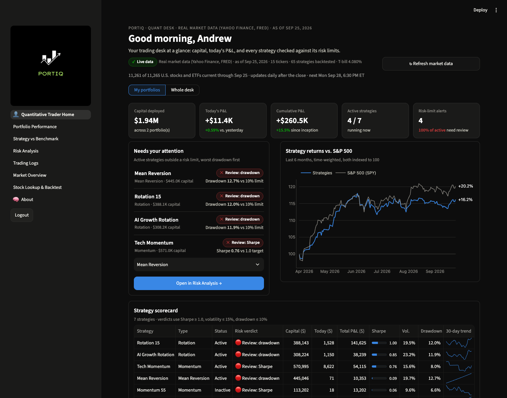
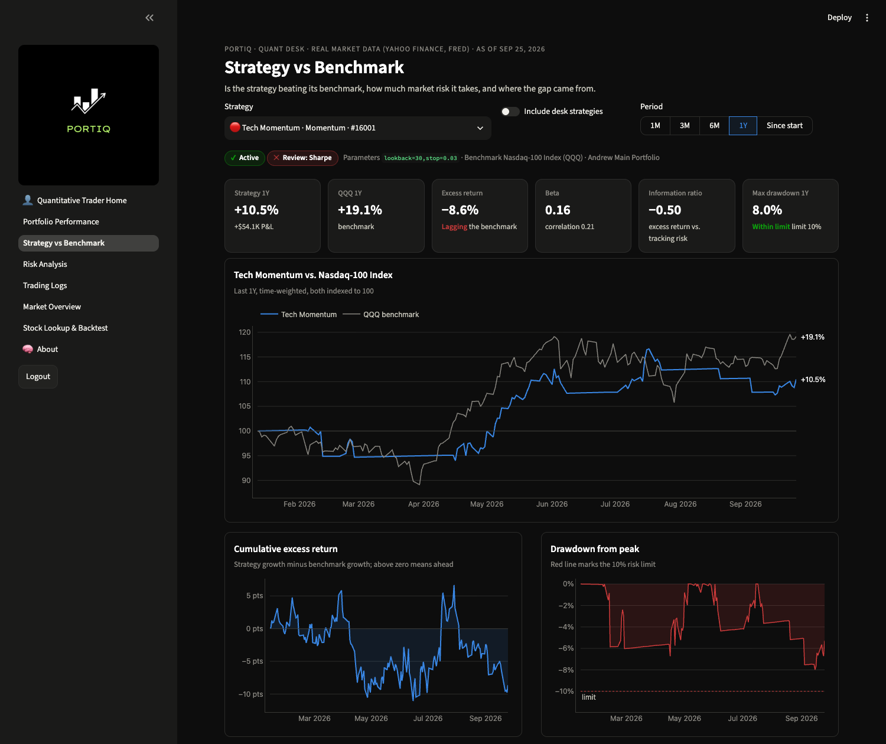
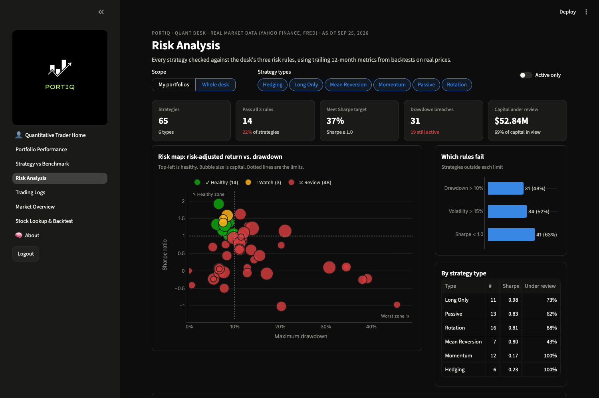
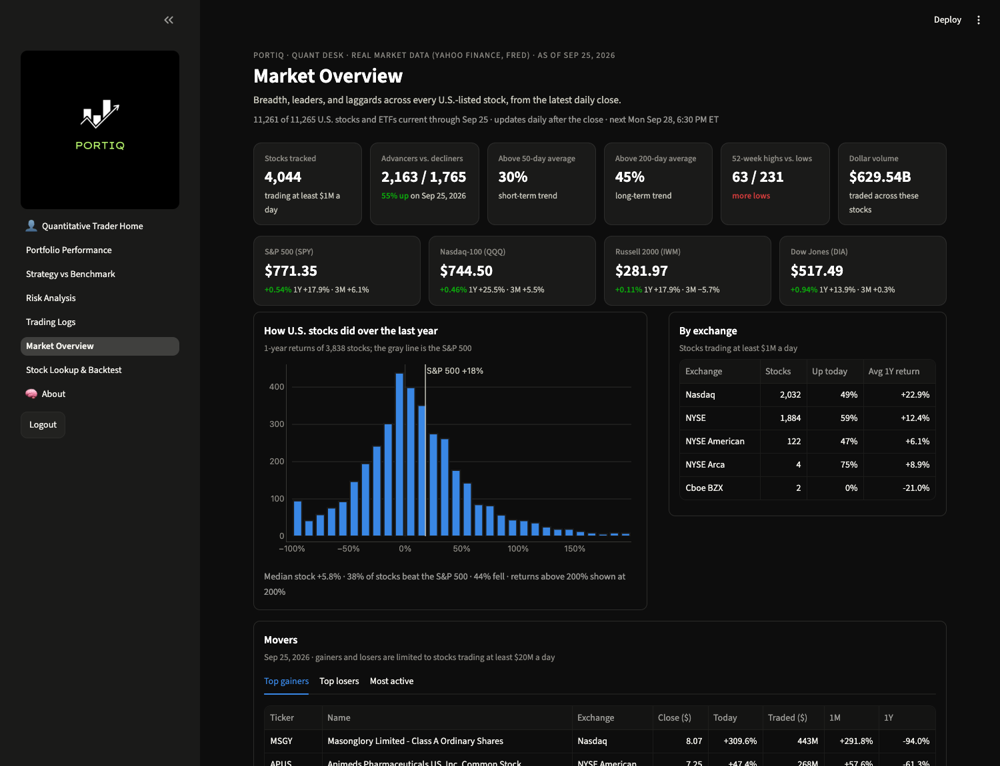
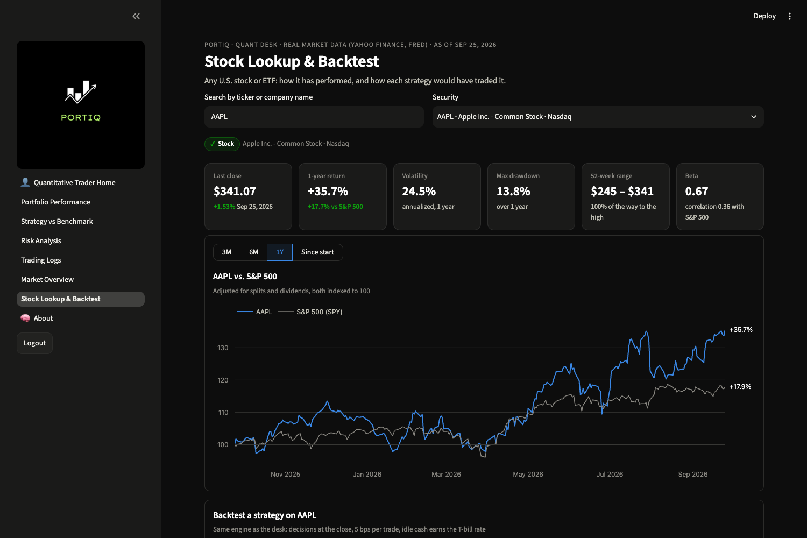

# PortIQ

PortIQ started as our CS 3200 (Database Design) project at Northeastern in Spring 2026. The idea was a single investing app where different kinds of users each get their own dashboard, all on the same database.

You log in as one of four users:

- **Andrew Rock**, a trader who tracks strategies, compares them to the market, checks risk, and keeps a log of trades
- **John Data**, a data analyst who manages datasets, cleans data, and builds charts and dashboards
- **Katrina Williams**, a CIO who manages user access, roles, and activity logs
- **Jane Doe**, a beginner investor with a simple view of her holdings and an AI assistant (Gemini) she can ask questions

There are no real passwords; you just pick who you want to be on the home page.



## The trader side

After the semester, the trader side kept growing. Instead of made-up numbers, it now pulls real daily prices for every U.S.-listed stock and ETF (around 11,000 of them) from Yahoo Finance, plus Treasury bill rates from FRED. The data updates on its own every weekday evening after the market closes.

Each strategy gets run against those historical prices, so its returns and risk numbers come from what actually happened in the market. There's also a page where you can look up any U.S. stock and see how each strategy would have done on it.

A few things that came out of it:

- Most of the strategies that trade actively did worse than just buying and holding the same stock (only 10 of 41 beat it).
- My first guess about why one strategy type was struggling turned out to be wrong. Trying different settings side by side showed it was trading too often.
- Over the past year the S&P 500 was up about 18%, but the typical U.S. stock was only up about 6%.

The SQL behind some of this is in [analytics/quant_trader_kpis.sql](analytics/quant_trader_kpis.sql).

The strategies, portfolios, and holdings are sample data we made up for the project. The prices and rates are real.

<table>
<tr>
<td width="50%"></td>
<td width="50%"></td>
</tr>
<tr>
<td width="50%"></td>
<td width="50%"></td>
</tr>
</table>

## Built with

Python, Streamlit for the frontend, Flask for the API, MySQL, and Docker. The charts use Plotly, and the strategy testing uses pandas and NumPy.

## Team

Yash Maheshwari, Sean Snaider, Ernesto B., and Shlok Patel

## Running it

You'll need Docker. First, copy the settings file:

```bash
cp api/.env.template api/.env
```

Then fill in `api/.env`. The defaults in the template mostly work. You need to set `SECRET_KEY` (any random string) and `MYSQL_ROOT_PASSWORD`. Add a `GEMINI_API_KEY` if you want Jane's AI assistant to work.

Start everything:

```bash
docker compose up -d
```

Then open <http://localhost:8501>. The API runs on port 4000, and MySQL is on port 3200.

On the first start, the app shows demo data for a few seconds while it pulls real prices for the strategies. Loading the full U.S. market takes about 30 minutes the first time, but you can use the app while it runs. After that, it updates every weekday at 6:30pm Eastern. You can change the time with `REFRESH_TIME` in `.env`, or set `REFRESH_UNIVERSE=false` to skip the full market.

To run the updates manually:

```bash
docker exec web-api python -m backend.market.refresh     # just the strategies
docker exec web-api python -m backend.market.universe    # whole market
```

## Good to know

- The SQL files in `database-files/` only run when the database is first created. If you change them, you have to wipe the database and start it again:

  ```bash
  docker compose down db
  docker volume rm project-app-team-repo_mysql_data
  docker compose up db -d
  ```

- Streamlit and Flask both reload when you save a file. In the browser, click "Always Rerun" when it asks.
- To see what's going on, run `docker compose logs api` (or `app`, `db`, `scheduler`).
